# SOLACE — human anchor preflight

**Decision required: APPROVE FINAL RENDER / ONE CONSOLIDATED CORRECTION REQUIRED / STOP.**

Current scene: [SOLACE_PHOTOREAL_GOAL_v01.blend](../../outputs/solace/SOLACE_PHOTOREAL_GOAL_v01.blend), assembly r12. All required textures packed. These are 960×540 / 48-sample Cycles previews, not the final video. [Opening at final resolution](opening-full-resolution.png) is 1920×1080 / up to 256 samples.

The independent critic considers this a serious review candidate, not a source-fidelity PASS. Remaining differences: opening reflection composition, approximate sofa/chair proportions and positioning, substitute forest, procedural secondary props. Camera was numerically fitted to source landmarks; exact source camera metadata was not available.

| Time | Authoritative source | Current reconstruction |
| --- | --- | --- |
| 0s |  |  |
| 2s | 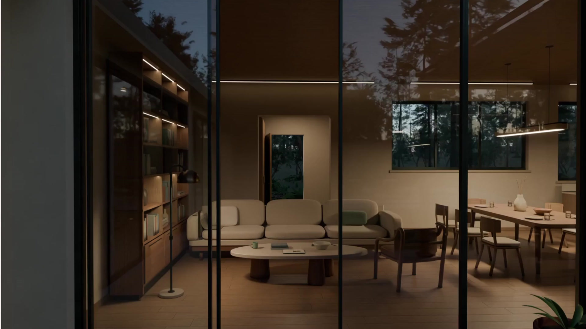 | 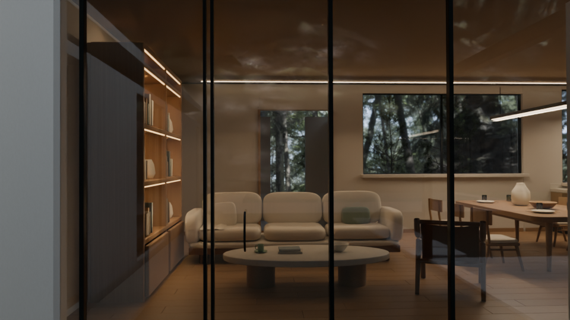 |
| 4s | 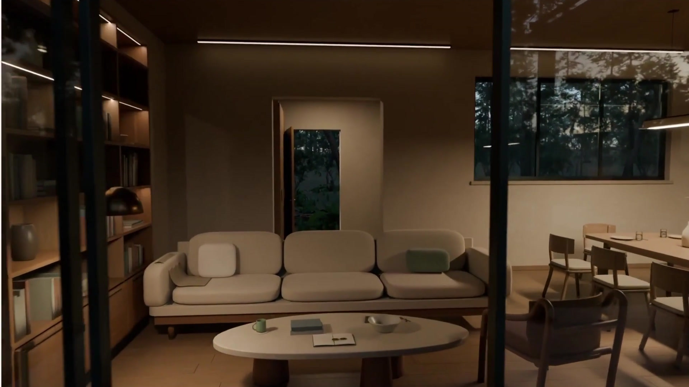 | 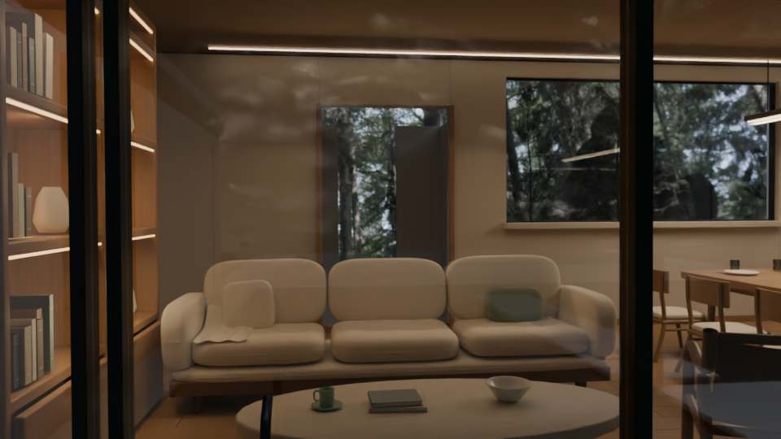 |
| 6s | 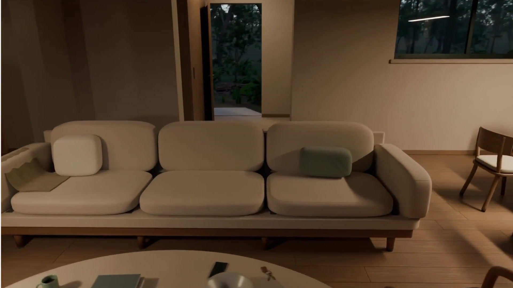 | 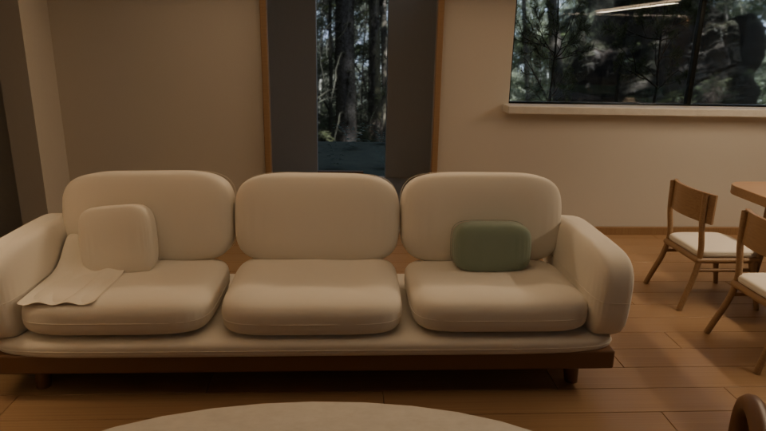 |
| 8s | 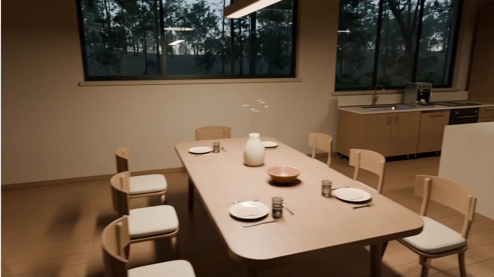 | 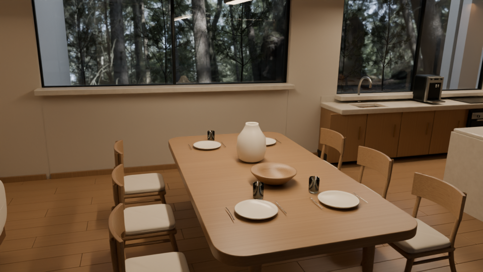 |
| 10s | 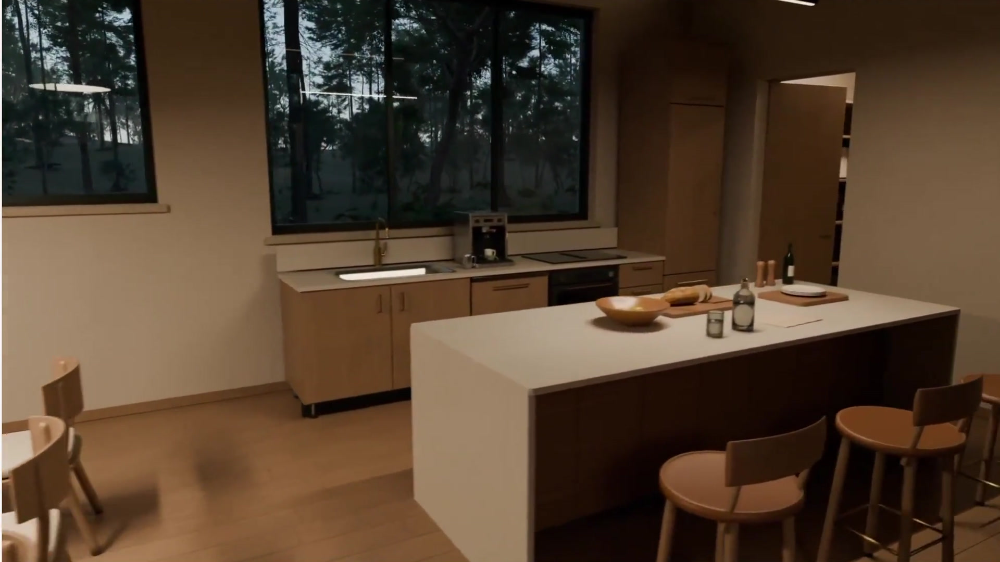 | 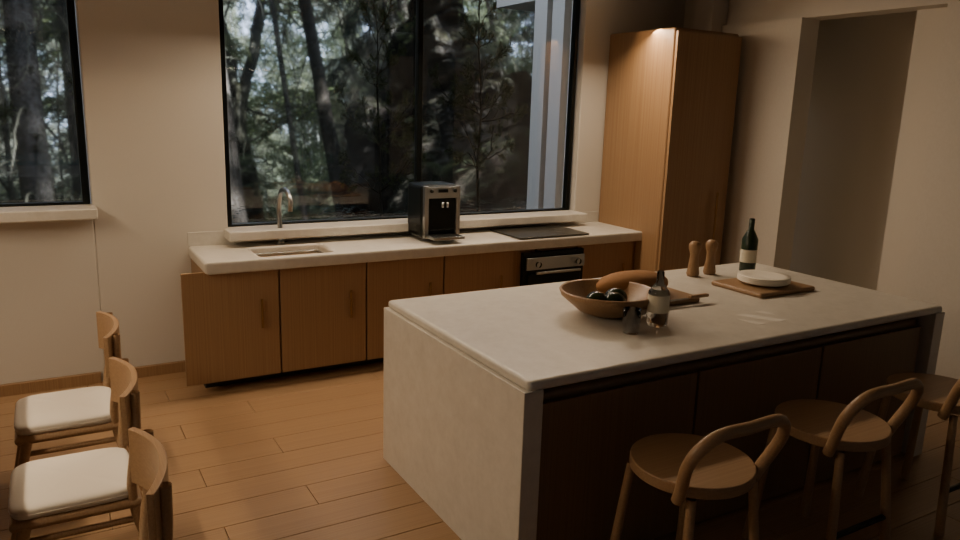 |
| 12s | 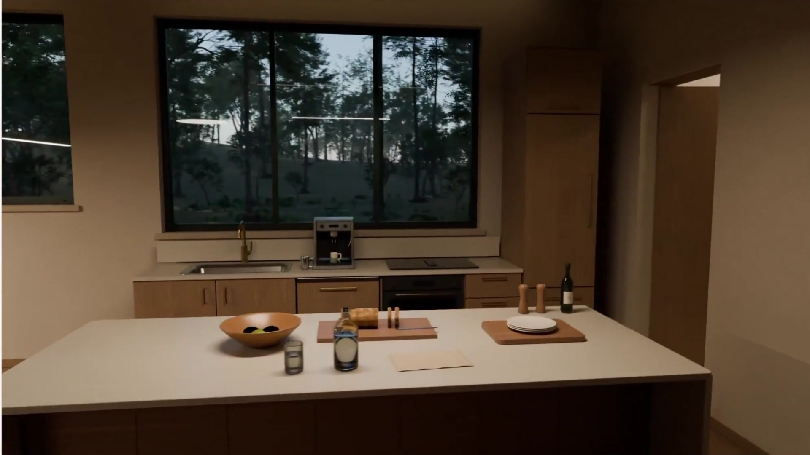 | 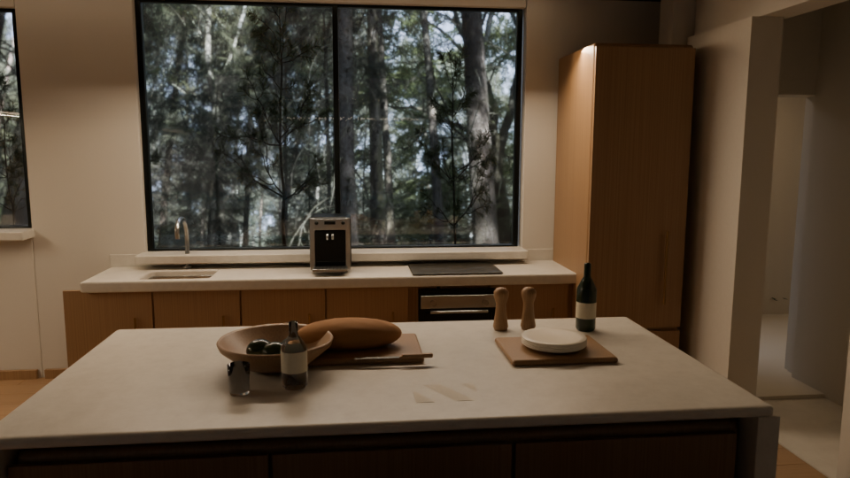 |
| 13.8s | 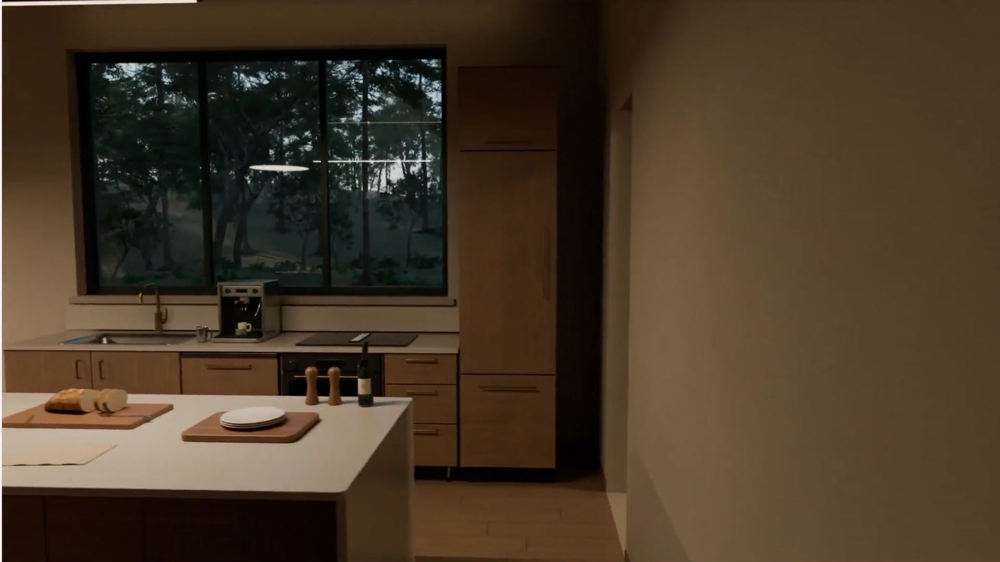 | 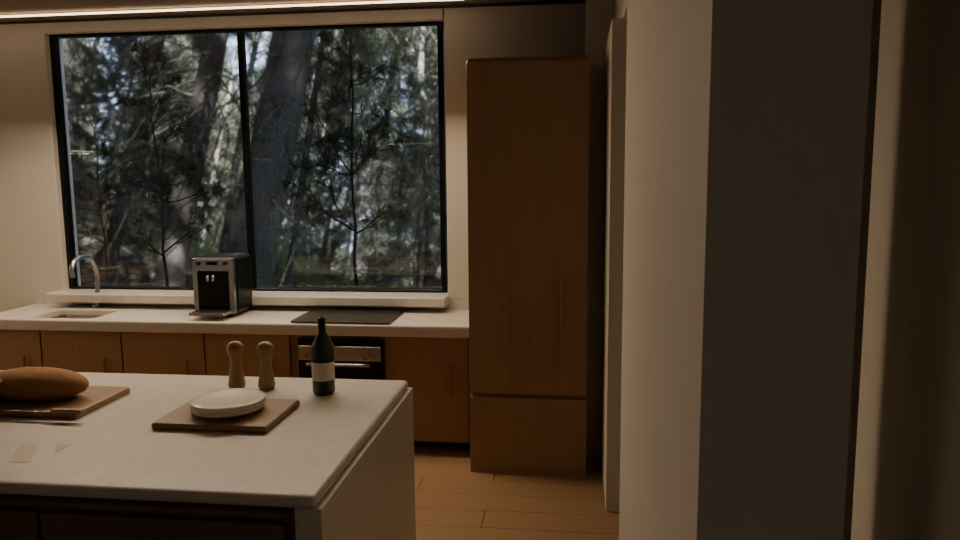 |

Final frame 420 / 13.967s: 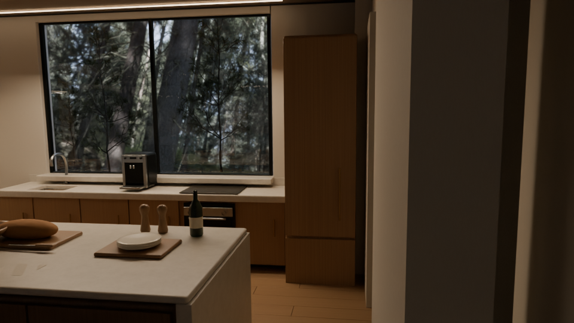

Full render is paused under the new cost gate in `docs/11-ASTRA-RUN-PLAYBOOK.md`, imported at ddc9084. Nine corrected full-resolution frames and the complete superseded r09 sequence remain preserved locally. No corrected final MP4 exists yet.

HUMAN VISUAL REVIEW: PENDING.
